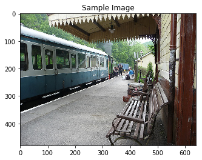
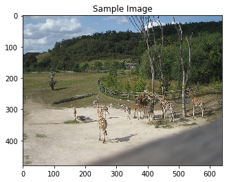
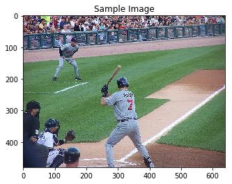
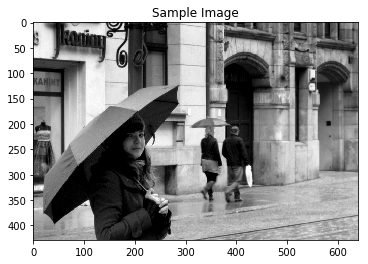

# Image Captioning

CNN-RNN hybrid model for generating captions for images. Part of the coursework for Udacity's Computer Vision Nanodegree.

Some successful results:

`a train is traveling down the tracks near a train station .`

`a group of giraffes standing in a grassy area with trees .`

`a baseball player swinging a bat at a ball in a game .`

An unsuccessful result that hints at overfitting:

`a man is walking on a sidewalk with a skateboard in the background`
